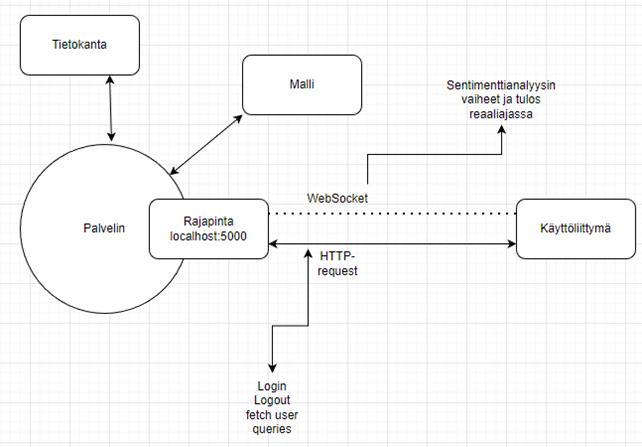
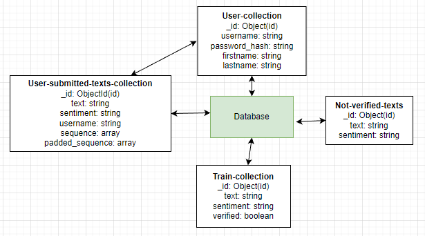
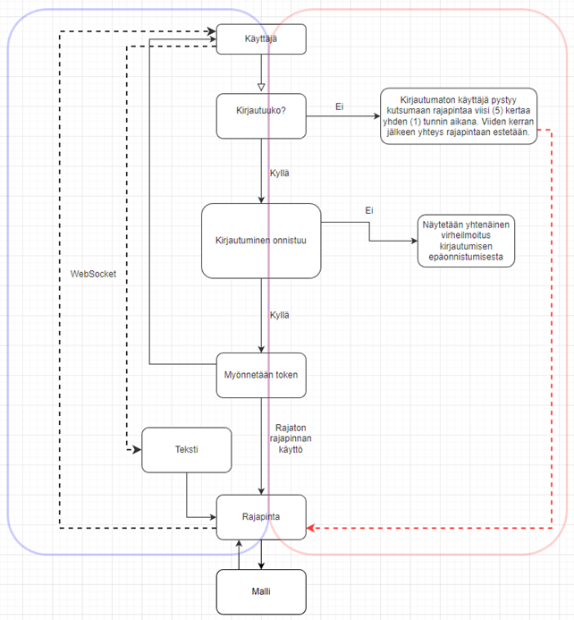

|-----------|----------|
| Dokumentti | Projektiraportti |
| Laatija | Janne Arkko |
| Versio | 1.6 |
| Päivämäärä | 11.4.2024 |

# Sentimenttianalyysi API ja käyttöliittymä

1. Tausta ja lähtökohdat

    Nykyisessä informaatioyhteiskunnassa tietovirrat ovat jatkuvia ja loputtomia ja ne sisältävät laajan kirjon erilaisia näkökulmia, aiheita ja tunnetiloja. Ihmiset altistuvat päivittäin valtaville määrille tietoa, mikä voi olla sekä hyödyllistä, että haitallista. Monet ihmiset kamppailevat usein löytääkseen jatkuvasta tietovirrasta luotettavaa ja merkityksellistä sisältöä.

    Mahdollisuudella analysoida tekstien sentimenttiä eli tunnetilaa, voi olla monia myönteisiä vaikutuksia. Informaatiolukutaito on ensiarvoisen tärkeää disinformaation aikakaudella ja sentimenttianalyysi voi tarjota syvällisempiä oivalluksia esimerkiksi uutisten sävyistä ja tunnelatauksista, auttaen käyttäjiä ymmärtämään paremmin erilaisia näkökulmia ja mielipiteitä. Tämä on erityisen tärkeää polarisoituneessa mediaympäristössä, jossa eri lähteiden tuottamat uutissisällöt voivat vaihdella suuresti. Jatkuva negatiivisille uutisille altistuminen voi vaikuttaa myös haitallisesti ihmisen mielenterveyteen. Mahdollisuus suodattaa uutisia tai analysoida blogiotsikoiden sentimenttejä, antaa käyttäjille mahdollisuuden suojella omaa hyvinvointiaan, tarjoamalla keinoja vähentää ahdistusta ja stressiä.

    Projekti toteutetaan Jyväskylän ammattikorkeakoulun informaatioteknologian instituutin järjestämien ’Deep Learning TTC8060-3008’, ’Web User Interface Programming TTC8420-3005’ sekä ’Web Server Programming TTC8430-3004’ -opintojaksojen yhdistettynä harjoitustyönä.

2. Tavoite

    Projektin päätavoitteena oli luoda sovellus, jonka rajapintojen kautta voi analysoida erilaisten tekstien sentimentin. Sentimentti voi olla joko positiivista, negatiivista tai neutraalia. Analyysia tuottava malli on kielimalli, jonka taustalla on Long-Short Term Memory (LSTM) algoritmi. Malli on koulutettu avoimen lisenssin datalla käyttäen useita eri lähteitä. Projektin toinen tavoite on parantaa mallin suorituskykyä ja kehittää sovelluksen rajapintaa vastaanottamaan laajoja datavirtoja, jonka jälkeen rajapintaa voisi markkinoida esimerkiksi uutistoimistoille, jotka pystyisivät ajamaan uutisotsikot rajapinnan kautta, saaden näin uutisille sentimenttileiman, jota pystyisi hyödyntämään uutisvirran rajauksessa loppukäyttäjän toimesta. Projektin toista tavoitetta ei käsitellä tässä raportissa enempää vaan se jätetään esimerkiksi opinnäytetyön tutkimusongelmaksi.

3. Vaiheistus

    3.1 Ensimmäinen vaihe

    Projekti alkoi ’Deep Learning TTC8060-3008’ -opintojaksolla kielimallin luomisella. Mallin kehittämiseen käytettiin avoimen lisenssin dataa, jota oli tuotettu muun muassa Twitterin (Nykyinen ’X’) teksteistä eli twiiteistä. Tietoperusta rakentui edellä mainitun lisäksi myös Yhdysvaltojen lentoyhtiöiden käyttäjäpalautteista sekä emonationaalisista suhtautumisista vallitsevaan säähän. Kaikkea tietoperustaan kerättyä dataa ei ole vielä mallille opetettu.

    3.2 Toinen vaihe

    Projekti toisessa vaiheessa kehitettiin sovelluksen palvelin ja rajapinta. Ohjelmointikieleksi valittiin jo mallintamisessa käytetty Python sekä Flask-kirjasto, sen tuomien yhteensopivuuskriteerien ja helppokäyttöisyyden vuoksi. Suorituskyvyn kannalta Python-ympäristö on myös erittäin hyvä ja monipuolinen.

    3.3 Kolmas vaihe

    Projektin kolmannessa vaiheessa kehitettiin sovelluksen käyttöliittymä. Käyttöliittymän kehittämiseen käytettiin React-kehystä JavaScript-ohjelmointikielellä. Käyttöliittymä hyödyntää React-Redux Toolkit -kirjastoa istuntojen hallinnassa sekä Tailwind CSS-kehystä liittymän ulkonäön kustomoimisessa.

4. Palvelin

    4.1 Rakenne

    Palvelimen rakenne on kehitetty niin, että rajapinta vastaanottaa pyyntöjä osoitteessa http://localhost:5000. Käyttöliittymän ja palvelimen keskusteluun käytetään http-protokollaa käyttäjän autentikointiin ja sisäänkirjautumiseen, sekä WebSocket-protokollaa tekstin sentimentin analysointiin ja sen vaiheiden lähettämiseen ja vastaanottamiseen käyttöliittymän ja palvelimen välillä. Tämä mahdollistaa reaaliaikaisen tiedonvaihdon, että turvallisen kirjautumismenettelyn käyttäenistuntomerkkejä (token) istuntojen varmentamiseen sekä tiedonvaihdon staattisen tiedon kanssa, esimerkiksi käyttäjän aiempien analyysien haun tietokannasta käyttäen http-protokollaa.

    

    4.2 Tietokanta

    Tietokannaksi projektille valittiin MongoDB, koska data, jota tallennetaan ja käytetään, on hyvin yksiselitteistä. Relaatiotietokannan käyttö olisi ollut myös perusteltua, mutta projekti päätettiin viedä tässä vaiheessa eteenpäin ilman relaatiotietokantaa. Erilaisia kokoelmia tietokannassa on yhteensä neljä, jotka on jaoteltu harjoitusdataan, käyttäjädataan, sekä näiden yhdistelmään, joka hyödyntää sentimentin vahvistamista sekä käyttäjäsidonnaisuutta, jolloin pystytään näyttämään käyttöliittymässä käyttäjän aiemmat haut ja tulokset sekä mallin kehittämisessä hyödynnetään pääasiallisesti käyttäjätunnuksella vahvistettujen sentimenttien tuloksia.

    

    4.3 Palvelimen toiminta

    Seuraavassa kuviossa on mallinnettu palvelimen toimintaa. Palvelimen toiminta perustuu käyttäjän- ja istunnonhallintaan tietokantaan ja paikalliseen selaimen tallennustilaan talletettavilla istuntomerkeillä eli tokeneilla. Tietokantaan tallennettavaa uusiutuvaa tokenia ei ole tämän dokumentin kirjoitushetkellä vielä sovellukseen lisätty.

    

    Kuvassa palvelimen toiminta on seuraavanlainen: Käyttäjä kirjoittaa analysoitavan tekstin syötekenttään ja lähettää syötteen palvelimelle. Jos käyttäjällä ei ole istuntomerkkiä eli tokenia selaimen tallennustilassa, niin palvelin vastaanottaa, analysoi ja lähettää ainoastaan viisi (5) uniikkia syötettä. Kirjautuneena käyttäjä pystyy hyödyntämään analysointia rajoituksetta.

    Tekstin analysointi tapahtuu WebSocket-protokollaa käyttäen, jolloin saavutetaan reaaliaikainen tiedonjako. Lyhyiden tekstien osalta prosessointi on hyvin nopeaa ja reaaliaikaisuuden hyöty on pieni, mutta pitkien tekstien analysoinnissa käyttäjä pystyy näkemään analysoinnin eri vaiheet.

    Kun käyttäjä rekisteröityy ja kirjautuu sisään niin palvelin tarkistaa käyttäjän olemassaolon tietokannasta, vertaa salattua salasanaa ja jos kaikki täsmää niin käyttäjälle myönnetään istuntomerkki.

    4.4 Reitit

    Palvelimella on kahdenlaisia reittejä: WebSocket-reittejä ja HTTP-reittejä. HTTP-reitit ohjaavat kirjautumista ja uloskirjautumista sekä käyttäjän kirjautuneena tekemiä aiempia tekstin analysointeja. WebSocket-reittejä käytetään ainoastaan analysointiin ja sen vaiheiden sekä lopputuloksen lähettämiseen palvelimen ja käyttäjän välillä.

5. Käyttöliittymä

    5.1 Rakenne

    Käyttöliittymä kehitettiin käyttämällä React-kehystä ja JavaScript ohjelmointikieltä. Käyttöliittymälle asetettiin tavoitteeksi olla mahdollisimman yksinkertainen ja toimiva ja se muodostuisi kahdesta pääelementistä: analyysiin käytettävästä elementistä sekä kirjautumiseen ja staattisten tietojen näyttämiseen käytettävästä sivuelementistä.

    Analyysi-elementin pääpiste on syöttökenttä, johon käyttäjä pystyy kirjoittamaan haluamansa analysoitavan tekstin. Analysoivan mallin luonteesta ja kyvyistä johtuen syötekenttää ja siihen kirjattua tekstiä ei validoida, koska tekstin osat voivat olla korreloivia tekstin sentimentin kanssa.

    Analyysi-elementin toinen osa on tulos-kenttä, jonne kirjataan palvelimen lähettämät analysoinnin osat ja lopputulos. Koska analysointiin käytettävä malli tarvitsee jatkuvaa harjoittelua, määritetään myös tähän elementtiin mahdollisuus muokata mallin tarjoamaa lopputulosta. Käyttäjä siis pystyy muokkaamaan analysoidun tekstin sentimentin sopivammaksi, joka edesauttaa mallin tulee harjoittelua. Tämä ei kuitenkaan ota huomioon virheellisesti muokattuja sentimenttejä. Korjattu sentimentti muutetaan tietokantaan palvelimen toimesta.
